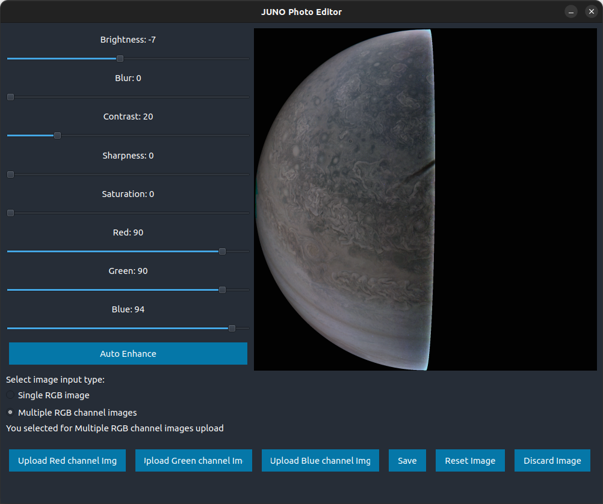
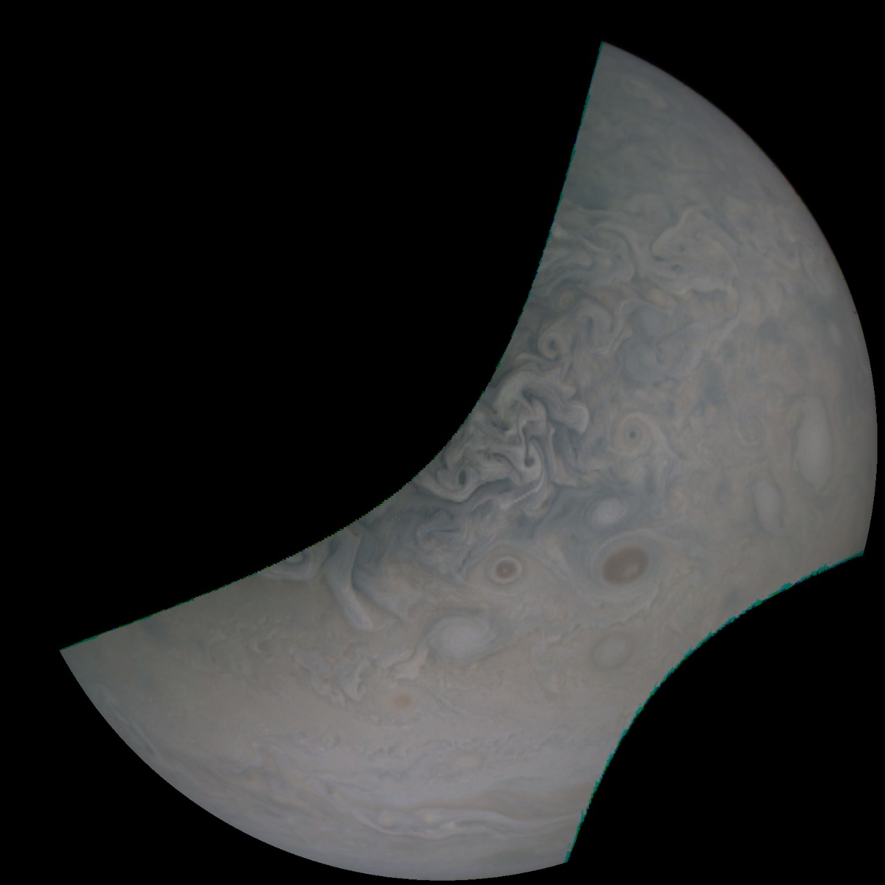
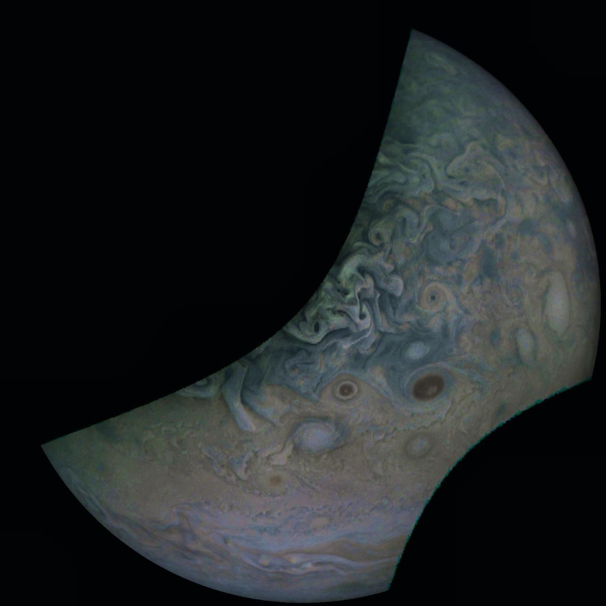

# JUNO CAM Editor
<!-- 
This app was made for [NASA SPACE-APPS CHALLENGE 2022](https://www.spaceappschallenge.org/) for the problem statement [Visualising the Jovian System](https://2022.spaceappschallenge.org/challenges/2022-challenges/jovian-system/details).  -->

JUNO CAM Editor is Python GUI program for modifying and enhancing the satellite images from the JUNO mission for producing images with more details, color balancing etc for understanding the image better. It can accept the images as different grey-scale images for each channels or as a combined color image. 

Functionalities provided by the application:
- Auto-Enhancing
- Color Balancing (Red, Blue & Green)
- Changing the Contrast
- Changing the Brightness
- Changing the Sharpness
- Changing the Saturation
- Image Stitching from multiple colour channels

## Setup
1. Fork the Repository then Clone it and open terminal in the repository folder
2. Create a virtual environment using
```bash
python3 -m venv space-app-venv
```
3. Activate the virtual environment using 
```bash
source space-app-venv/bin/activate
```
4. Install the requirements using 
```bash
pip3 install -r requirements.txt
```
5. Run the application from `main.py`
```bash
python3 main.py
```


## Example





